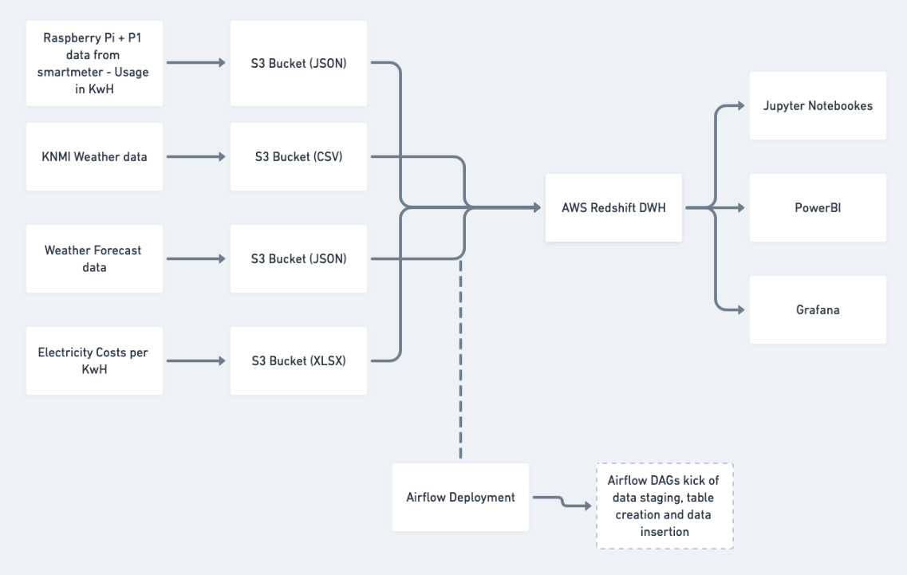
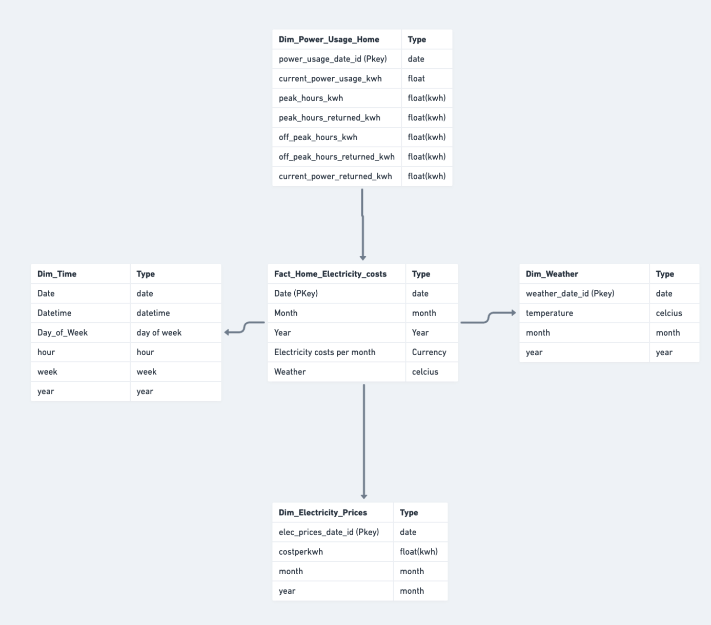

# home-energy-predictor

## Introduction
This project retrieves data from your smart meter and pushes into dwh for analysis, combined with several external data sources like weather (future relase), weather forecasts (future release) and electricity prices. Currently this code will allow you to calculate costs on your current power usage in your house based on the latest electricity prices.


## Architecture
The architecture of the Home Energy Predictor consists of a myriad of technologies. Streaming data is being collected from your Raspberry Pi through a P1 cable into the cloud (S3 blob storage). On a daily basis an Airflow data pipeline is run to push the data into AWS Redshift (future release). 



## Choice of technology
For data storage I have chosen to use S3 since this is extremely scalable, cheap and quite easy to integrate with a myriad of cloud native technologies out there. 

As for database technology I have chose to use AWS Redshift since this is heavily based on SQL technology, which is again highly scalable and is commonly used by many. This allows for easy transfer of knowledge and is easy understandable by other colleagues in the data engineering world.

As for languages  I have used a combination of SQL, Python and Pandas to be able to extract, transfer and load the data into the Redshift DWH. These are all languages and tools heavily used by the community and are easy understandable. Hence, my decision to use these tools. 

## Different scenarios
- Data increased by 100x: Due to the scalable of the tools used above this should not be an issue for the Energy Predictor tool.
- Pipelines each day at 7am: By implementing a DAG using Airflow its quite easy to run the ETL processes daily on 7am. 
- Database accessed by 100+ users: The DWH Redshift database can handle up to 500 concurrent connections. Also, most likely when there are more users connected to the Redshift database the hardware specs of the Redshift database will need to be increased to handle the load. If users don't need to perform INSERT or UPDATE it would also be possible to periodically copy the data to a NoSQL database like Cassandra. 

## Data types & files

Currently two different data types are used in this projecct to process data: JSON & CSV. Find under the `/data` dir examples of these files. 
- Electricity Costs data (CSV): This data is coming from the Dutch statistics bureau. This data is used to calculate how much the usage of electricity will cost based on kWh per month
- Power usage costs (JSON): This data is coming directly from your (compatible) smart meter in your home using a P1 cable connected to a Raspberry Pi. This JSON is an example of how this looks like. Typically the following the data is tracked in the JSON:
```{"current_power_usage_kwh": 0.033, "gas_usage_m3": 631.549, "datetime": "31-05-2021-23-55", "peak_hours_kwh": 3083.134, "peak_hours_returned_kwh": 223.795, "off_peak_hours_kwh": 2491.676, "off_peak_hours_returned_kwh": 102.211, "current_power_returned_kwh": 0.0}```

The following files are in this repo:
- `create_tables.py`: this python file creates the tables that are required to load and ingest the data into the redshift database
- `etl.py`: This file processes the different data sources into the proper dimension & fact tables
- `p1_data_p1.py`: This file is run every 5 mins on a Raspberry Pi connected to the Smartmeter. The python file reads the output of the data and translates this into a JSON file. Finally, the JSON is copied across into S3.
- `terraform/*`: this directory contains all the IaC to provision Airflow & AWS Redshift. Make sure to have installed `terraform 0.13` to properly run this code. To provision infrastructure run the following commands: `terraform init`, `terraform plan` and `terraform apply`.

## Schema and data modelfor DWH

In this section the schema's for the database are explained. The data schema is based on a Star schema, using a physical model. Generally speaking a Star schema has several dimension tables and a fact table. The star schema consists of one or more fact tables referencing any number of dimension tables. The benefits are that the tables are denormalized, queries are simplified and aggregations will go faster. Drawbacks of the star schema model is decreased query flexbility and many to many relationships. This could negatively impact the performance of the database. 

`Fact_Home_Electricity_Costs`: This is the fact table that shows the costs per month for your live electricity usage. This table has the following schema:
- `elec_prices_date_id`, `electricity_costs_per_month	`, `month`, `year`

| Field Name | Datatype | Field Length / Precision | Constraint | Description |
| --------------- | --------------- | --------------- | -------- | --------- |
| Row 1 Column 1 | Row 1 Column 2 | Row 1 Column 3 |
| Row 2 Column 1 | Row 2 Column 2 | Row 2 Column 3 |
| Row 3 Column 1 | Row 3 Column 2 | Row 3 Column 3 |


|Field Name |Datatype |Field Length / Precision |Constraint | Description|
|:--- | :---: | ---:|
| elec_prices_date_id | INT IDENTITY | 10 / 10 | N/A | This is the field that uniquely identifies the value of the row |
| month | VARCHAR | 256 / 256 | N/A | This column shows the the month |
| electricity_costs_per_month	 | FLOAT8 |17 / 17 | N/A | This is the calculation of the cost per month of electricity based on table `power_usage_home` & `Electricity prices`. |
| power_usage_date_id | FLOAT8 | 19 / 19 | FOREIGN KEY to `power_usage_home` table |
| elec_prices_date_id | FLOAT8 | 19 / 19 | FOREIGN KEY to `electricity_prices` table |


`Dim_Power_Usage`: This is a dimension table consisting of all electricity usage coming from your P1/Smartmeter data deployed on 
Raspbery Pi. This table has the following schema:
- `power_usage_date_id`, `current_power_usage`, `peak_hours`, `peak_hours_returned`, `off_peak_hours`, `off_peak_hours_returned`, `current_power_returned`

`Dim_Electricity_prices`: This is a dimension table that has the latest electricity prices available from the Dutch statistics bureau (CBS) with the following schema:
- `elec_prices_date_id`, `costperkwh`, `month`, `year`

`Dim_Weather`: This is a dimension table that has all the weather data from the last 100 years in the Netherlands (popoulated in future release)
- `weather_date_id`, `temperature`, `month`, `year`

`Dim_Time`: This is a dimesion table that has timestamps of power usage broken down into specific units
- `date`, `datetime`, `week`, `hour`, `year`, `day of week`, `month`


